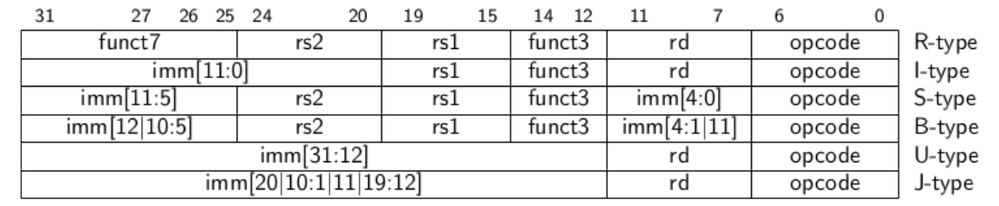
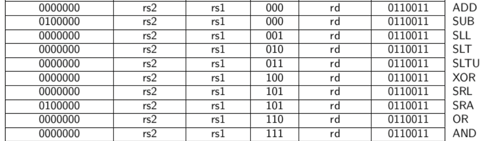
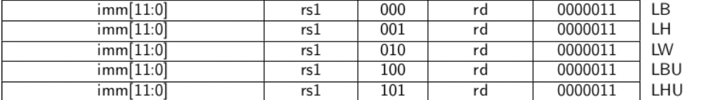
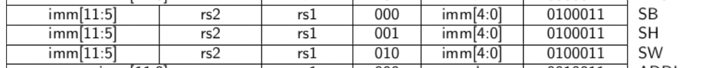
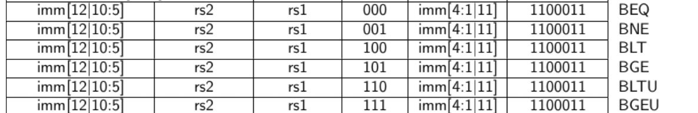
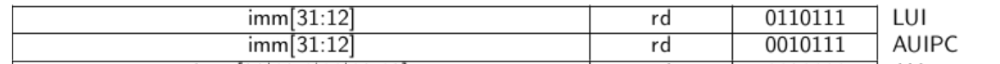
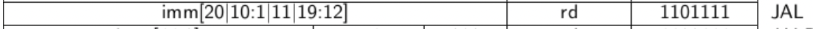
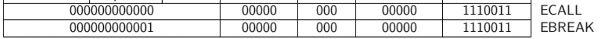

2## Instruction Memory

- A note on wire vs. reg: The left-hand-side of an assign statement must be a net type (e.g., wire), while the left-hand-side of a procedural assignment (in an `always` block) must be a variable type (e.g., reg). These types (wire vs. reg) have nothing to do with what hardware is synthesized, and are just syntax left over from Verilog's use as a hardware simulation language. 
- Non-blocking assignment statements are **allowed to be scheduled without blocking the execution of the following statements and is specified by a (`<=`) symbol**. The same symbol is used as a relational operator in expressions, and as an assignment operator in the context of a non-blocking assignment. http://www.asic-world.com/tidbits/blocking.html
- Implementation of clock in test bench.
	```verilog
	reg clk;
	initial clk = 0;
	always #10 clk = ~clk;
  ```
- Errors are caused when the circuit is mixed of unsynchronized sequential and combinational logic.
- **Latching:** When the output is to be a net but to be assigned inside a sequential circuit, the output is latched in a register, and then assigned to the wire outside the sequential circuit.
---
## Decode Logic



#### R-Type Instructions



#### I-Type Instructions



#### S-Type Instructions



#### B-Type Instructions



#### U-Type Instructions



#### J-Type Instructions



#### Misc.



---
## Bus between Decoder and CU

| bus[i] | instr    |
| ------ | -------- |
| 0      | `add`    |
| 1      | `sub`    |
| 2      | `xor`    |
| 3      | `or`     |
| 4      | `and`    |
| 5      | `sll`    |
| 6      | `srl`    |
| 7      | `sra`    |
| 8      | `slt`    |
| 9      | `sltu`   |
| 10     | `addi`   |
| 11     | `xori`   |
| 12     | `ori`    |
| 13     | `andi`   |
| 14     | `slli`   |
| 15     | `srli`   |
| 16     | `srai`   |
| 17     | `slti`   |
| 18     | `sltiu`  |
| 19     | `lb`     |
| 20     | `lh`     |
| 21     | `lw`     |
| 22     | `lbu`    |
| 23     | `lhu`    |
| 24     | `sb`     |
| 25     | `sh`     |
| 26     | `sw`     |
| 27     | `beq`    |
| 28     | `bne`    |
| 29     | `blt`    |
| 30     | `bge`    |
| 31     | `bltu`   |
| 32     | `bgeu`   |
| 33     | `jal`    |
| 34     | `jalr`   |
| 35     | `lui`    |
| 36     | `auipc`  |
| 37     | `ecall`  |
| 38     | `ebreak` |

### Testing Instructions

| Instruction Name | HEX        | Binary                           |
| ---------------- | ---------- | -------------------------------- |
| addi x2, x2, 1   | 0x00110113 | 00000000000100010000000100010011 |
| addi x1, x1, 1   | 0X00108093 | 0000 0000 0001 0000 1000 0000 1001 0011 |
| jal x3, -4       | 0xffdff1ef | 11111111110111111111000111101111 |


---
## Control Unit

The control unit should be able to:

- Handle all JUMP instructions
	- For `B` type instructions, set PC to required instruction as per Jump Instruction
	- For `JAL` and `JAR` instruction, simply write to `rd` and so on(mostly ALU thing9)
- Prepare for ALU to perform Operations
	- Read `rs1` `rs2` and store `rd` into register file.
- Handle all `load` and `store` instructions by itself.